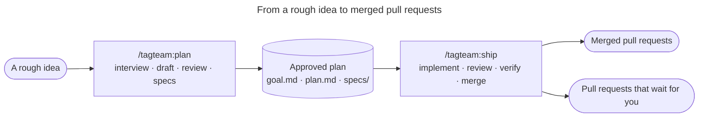
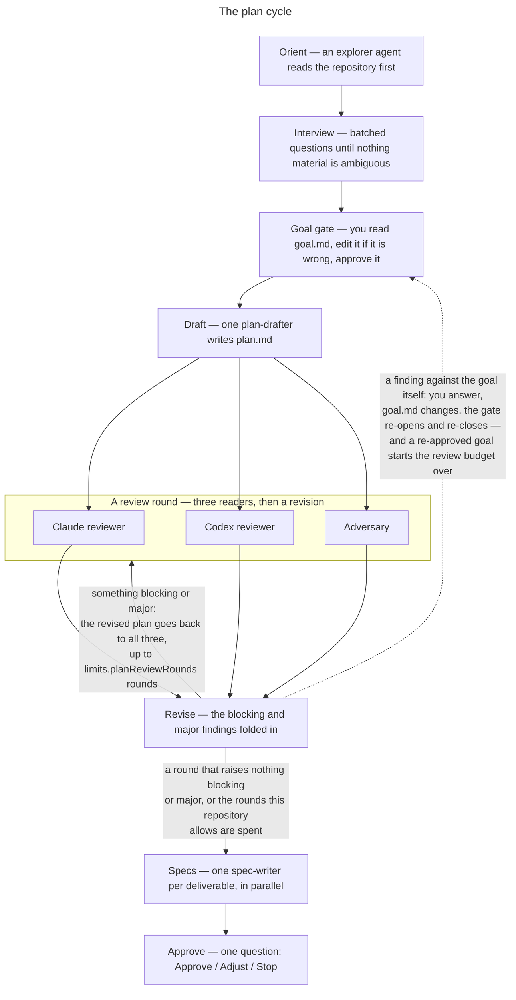
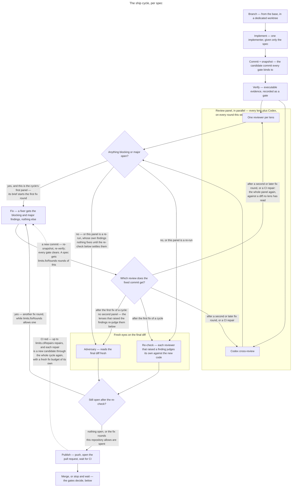
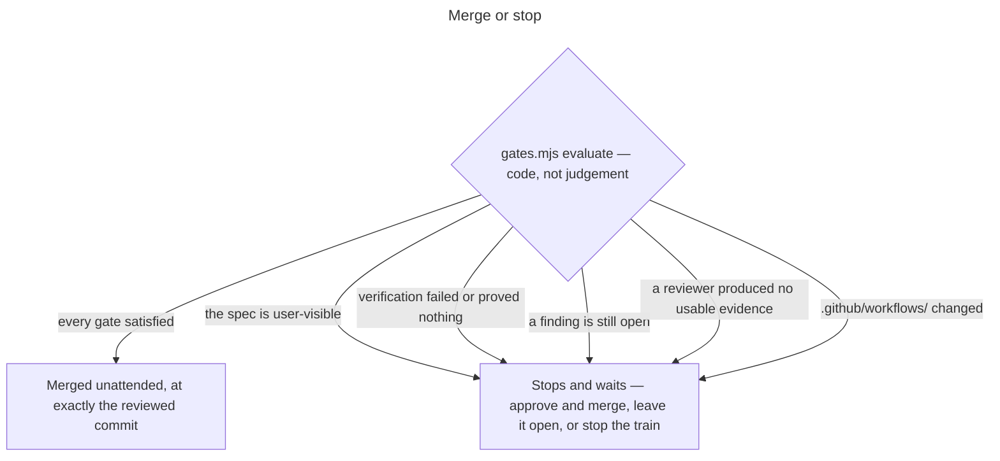

# tagteam

A Claude Code plugin that takes a change from a vague idea to merged pull
requests, using Claude and Codex together. It is multi-agent orchestration for
agentic, spec-driven development: autonomous AI agents from Anthropic and
OpenAI plan the work, implement it, and cross-review every diff, with an
adversarial AI code review on both the plan and the code.

You describe what you want, however roughly. Tagteam interviews you until the
outcome is concrete, writes a plan, has it reviewed by three independent readers
for as many rounds as you allow, and breaks it into spec files. Then it implements those specs one at a
time — each in its own branch, each reviewed by a cross-engine panel, each
verified — and merges the ones that need no judgement from you. The ones that do
stop and wait.

It is for changes big enough that you want them delegated and not so opaque that
you cannot check them. Every decision you make is written to a file you can edit.
Every merge happens at the exact commit that was reviewed.



## Install

Requires Claude Code, Git, the [Codex CLI](https://github.com/openai/codex), and
an authenticated GitHub CLI.

```bash
claude plugin marketplace add Smiley73/tagteam
claude plugin install tagteam@tagteam
```

There is no release to download — Claude Code installs plugins from the
repository itself, and `claude plugin update` picks up each version bump. From
a local checkout, `claude plugin marketplace add` the checkout's absolute path
instead, or run Claude Code with `--plugin-dir /absolute/path/to/tagteam`.

[CodeGraph](https://github.com/colbymchenry/codegraph) is optional, but every
agent tagteam dispatches can use it: one query returns a symbol's source
together with its callers, so a reviewer sees a diff's blast radius — and an
implementer the code around its change — without spending context on search.
Without the index the agents read files instead; with `codegraph` on your
PATH, `/tagteam:init` offers to build one.

## Use

```text
/tagteam:init
/tagteam:plan Add account recovery with auditable security events
/tagteam:ship .tagteam/plans/add-account-recovery
/tagteam:status
```

Run `/tagteam:plan` and `/tagteam:ship` in **separate sessions**. The interview
loads repository material that shipping does not need, and context is the thing
that runs out.

### Planning



1. **Interview.** Questions in batches, informed by reading the repository first.
   Multiple choice where there are real options. Questions are about the outcome
   and asked in plain language — the symbols, paths and line numbers behind them
   stay in the notes, so answering never means opening a file. Product and
   interface decisions are always yours; when you have no preference, tagteam
   decides and records the reasoning and what it rejected.
2. **Goal gate.** The interview writes `goal.md`. You read it, edit it if it is
   wrong, and everything downstream binds to the file rather than to the
   conversation.
3. **Draft and review.** One drafter writes a plan. A Claude reviewer, a Codex
   reviewer, and an adversary read it in parallel; a revision folds their
   blocking and major findings in, and the revised plan goes back to all three
   for another round. `limits.planReviewRounds` is how many rounds one approved
   goal gets — a round that raises nothing blocking or major ends it earlier, and
   re-approving a changed goal starts the count again.
4. **Specs.** One file per deliverable, written in parallel, each self-contained
   for the implementer that will receive it.
5. **Approve.** Sizes reported once, reviewer selection shown as a default set
   plus named exceptions, and one question.

### Shipping

Per spec, in dependency order: branch, implement, verify, review, fix, re-check,
publish, merge — with the fix and the review repeating for as many rounds as you
allow.



Each lens is calibrated by a brief: the plugin ships fourteen, and a repository
adds its own by committing `.tagteam/lenses/<lens>.md`. That is how a project
whose correctness lives in tax years or dosages gets a `financial` or a `math`
reviewer the plugin could never have written, and a brief named after one the
plugin ships replaces it. A rostered lens with a brief in neither place is
refused rather than reviewed on improvisation.

The review panel is the spec's lenses plus a Codex cross-review. After a fix
round, each reviewer that raised a finding re-checks its own findings against the
new code, and an adversary reads the fixed diff fresh. Anything still open starts
another round, for as many rounds as `limits.fixRounds` allows; when they run out
the pull request stops with the findings on it and says so.

A pull request merges unattended unless: the spec is marked user-visible,
verification failed or CI proved nothing, a finding is still open, **a reviewer
produced no usable evidence**, or `.github/workflows/` changed.

That fourth one matters more than it sounds: an absent or malformed findings file
yields an empty finding set, and an empty finding set otherwise reads as a clean
review.



## How it is built

The orchestrator is the main Claude Code agent following the command files. It
runs git, Codex, and this plugin's scripts directly, and dispatches subagents only
for model work. Subagents write their own outputs; the orchestrator reads them.
Nothing large is ever moved between steps by passing it through a model.

Decisions that are silent when wrong are code, not prose: which commit gets
merged, whether the gates are satisfied, and how CI checks classify. Everything
else is the command file.

State is files on disk. There are no fingerprints, reuse ledgers, or invocation
records — a re-run looks at what exists and continues from the first thing that
does not.

## Safety

- Reviewers have no write or shell tools. Codex runs `read-only` and only ever
  reviews.
- Codex runs through `codex exec --output-schema`. MCP is unsupported because its
  tool contract cannot enforce a response schema.
- Every gate binds to one commit; a new commit clears all of them, and every fix
  round makes one.
- Merges use `--match-head-commit`, and refuse outright if the base branch moved
  since the review — the reviewed diff would be going into something else. Any
  merge failure stops and reports rather than rebasing.
- A commit is only made through `git add -A && guard-staged && git commit`, which
  refuses to commit a copied ignored file.
- User-visible changes always wait.

## Reference

[skills/tagteam/SKILL.md](skills/tagteam/SKILL.md) — configuration, artifact
layout, the Git protocol, the Codex bridge, and recovery.
[examples/config.json](examples/config.json) — a complete configuration.

## Development

```bash
npm test
```

Node built-ins only, no dependencies.

The diagrams in this file are Mermaid source. GitHub renders them, and changing
one is a text edit here, with no image files to regenerate.

A repository that calibrates its own lenses needs plugin 0.8.2 or newer
**everywhere it is run**. The configuration version did not change, so an older
snapshot validates the file, reaches a roster entry it cannot find a brief for
inside itself, and refuses it — telling whoever ran it to drop the lens. Commit
the brief and the roster entry that names it in the same commit, and refresh the
plugin below.

This repository self-hosts tagteam. Unless you start Claude Code with
`--plugin-dir`, it runs the installed plugin snapshot rather than this working
tree: `.tagteam/config.json` is read live from the repository, but the scripts
and command files reading it belong to the snapshot. A change to a plugin file
does nothing here until the snapshot is refreshed; a change to that file's
`version` does worse, because the snapshot's validator compares it against its
own and exits 3, stopping `/tagteam:plan` and `/tagteam:ship` with an
instruction to run the old snapshot's `/tagteam:init` — which would rewrite the
config back.

Which refresh applies depends on which version moved. If the package version in
`.claude-plugin/plugin.json` and `.claude-plugin/marketplace.json` was raised,
update in place:

```bash
claude plugin marketplace update tagteam
claude plugin update tagteam@tagteam
```

For every other change — including a `.tagteam/config.json` version bump at an
unchanged package version, the usual case while developing — `update` reports
there is nothing to do. Run `claude plugin uninstall tagteam@tagteam` and
install again with the [Install](#install) command. Restart the session either
way.

## License

MIT. See [LICENSE](LICENSE).
