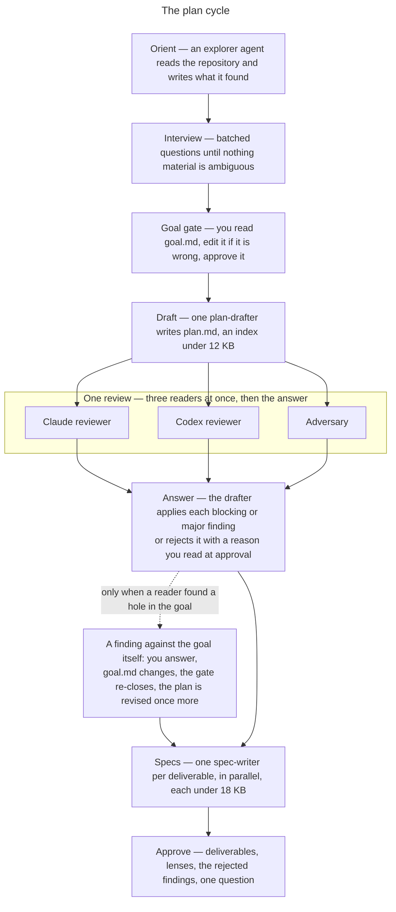
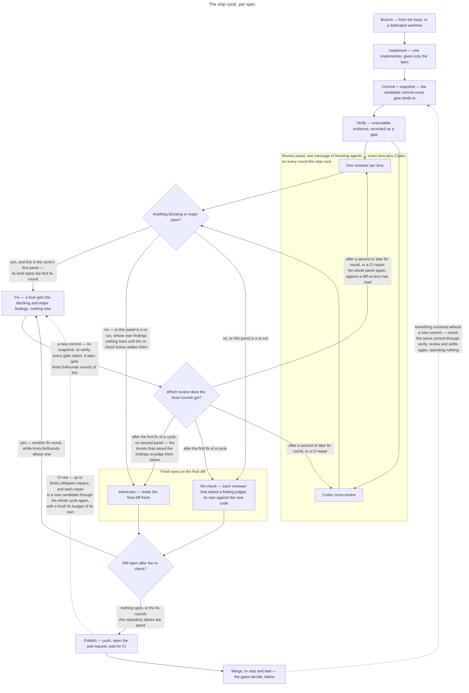
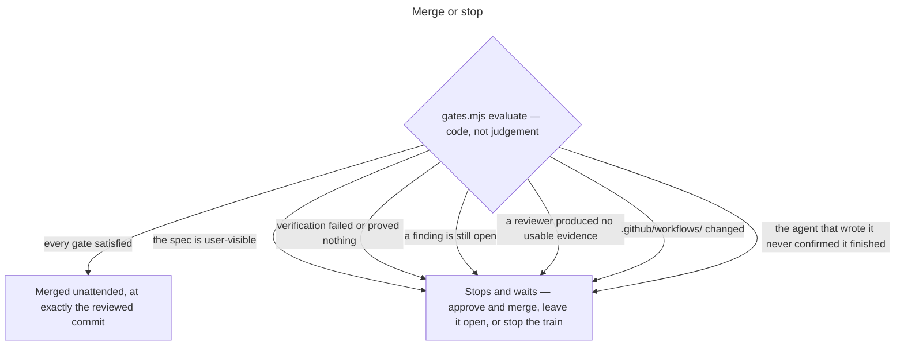

# tagteam

A Claude Code plugin that takes a change from a vague idea to merged pull
requests, using Claude and Codex together. It is multi-agent orchestration for
agentic, spec-driven development: autonomous AI agents from Anthropic and
OpenAI plan the work, implement it, and cross-review every diff, with an
adversarial AI code review on both the plan and the code.

You describe what you want, however roughly. Tagteam interviews you until the
outcome is concrete, writes a plan, has it read once by three independent
reviewers whose findings the drafter answers in writing, and breaks it into spec
files. Then it implements those specs one at a time — each in its own branch,
each reviewed by a cross-engine panel, each verified — and merges the ones that
need no judgement from you. The ones that do stop and wait.

It is for changes big enough that you want them delegated and not so opaque that
you cannot check them. Every decision you make is written to a file you can edit.
Every merge happens at the exact commit that was reviewed.


## Install

Requires Claude Code, Git, the [Codex CLI](https://github.com/openai/codex), and
an authenticated GitHub CLI.

```bash
claude plugin marketplace add Smiley73/tagteam
claude plugin install tagteam@tagteam
```

There is no release to download — Claude Code installs plugins from the
repository itself, and `claude plugin update` picks up each version bump. From
a local checkout, `claude plugin marketplace add` the checkout's absolute path
instead, or run Claude Code with `--plugin-dir /absolute/path/to/tagteam`.

[CodeGraph](https://github.com/colbymchenry/codegraph) is optional, but every
agent tagteam dispatches can use it: one query returns a symbol's source
together with its callers, so a reviewer sees a diff's blast radius — and an
implementer the code around its change — without spending context on search.
Without the index the agents read files instead; with `codegraph` on your
PATH, `/tagteam:configure` offers to build one.

## Use

```text
/tagteam:configure
/tagteam:plan Add account recovery with auditable security events
/tagteam:ship .tagteam/plans/add-account-recovery
/tagteam:status
```

Run `/tagteam:plan` and `/tagteam:ship` in **separate sessions**. The interview
loads repository material that shipping does not need, and context is the thing
that runs out.

### Planning



1. **Interview.** Questions in batches, informed by reading the repository first.
   Multiple choice where there are real options. Questions are about the outcome
   and asked in plain language — the symbols, paths and line numbers behind them
   stay in the notes, so answering never means opening a file. Product and
   interface decisions are always yours; when you have no preference, tagteam
   decides and records the reasoning and what it rejected.
2. **Goal gate.** The interview writes `goal.md`. You read it, edit it if it is
   wrong, and everything downstream binds to the file rather than to the
   conversation.
3. **Draft and review.** One drafter writes a plan. A Claude reviewer, a Codex
   reviewer, and an adversary read it at the same time. The drafter then answers
   every blocking and major finding by id: it applies the ones it accepts and
   writes one line on why for each one it rejects, and you read the rejections
   when you approve. There is no second review round. Across every plan this
   plugin had reviewed, no round of three readers ever closed with nothing
   blocking or major, so a loop that ran until one did ran to its budget every
   time, finding new things in each revision.
4. **Specs.** One file per deliverable, written in parallel, each self-contained
   for the implementer that will receive it. A plan is an index and a spec says
   what the repository cannot; both have a size the run enforces.
5. **Approve.** Deliverables in dependency order, the lenses each will get, the
   findings the drafter declined and why, and one question.

### Shipping

Per spec, in dependency order: branch, implement, verify, review, fix, re-check,
publish, merge — with the fix and the review repeating for as many rounds as you
allow. A driver script sequences every step and prints every dispatch; the
orchestrating agent runs it, dispatches what it prints, and talks to you.



Each lens is calibrated by a brief: the plugin ships eight, and a repository
adds its own by committing `.tagteam/lenses/<lens>.md`. That is how a project
whose correctness lives in tax years or dosages gets a `financial` or a `math`
reviewer the plugin could never have written, and a brief named after one the
plugin ships replaces it. A rostered lens with a brief in neither place is
refused rather than reviewed on improvisation.

The review panel is the spec's lenses plus a Codex cross-review, dispatched as
one message of blocking agents that run at the same time. Codex is told which
lenses are reading beside it and hunts for what falls between them. After a fix
round, each reviewer that raised a finding re-checks its own findings against
the new code, and an adversary reads the fixed diff fresh. Anything still open
starts another round, for as many rounds as `limits.fixRounds` allows; when they
run out the pull request stops with the findings on it and says so.

Each job thinks as hard as its work needs: the implementer, the fixer and the
adversary at high effort by default, lens reviewers at medium, and re-checks —
which only have to say whether one fix landed — at low. Every one of those is a
setting in `.tagteam/config.json`.

A pull request merges unattended unless: the spec is marked user-visible,
verification failed or CI proved nothing, a finding is still open, **a reviewer
produced no usable evidence**, `.github/workflows/` changed, or the agent that
wrote it never confirmed it finished what it was given.

That fourth one matters more than it sounds: an absent or malformed findings file
yields an empty finding set, and an empty finding set otherwise reads as a clean
review.

A person can approve past some of those stops and not others. User-visible, a
workflow change, and an unconfirmed account are theirs to accept; a failed
verification, an open finding, and a reviewer that produced no usable evidence
are cleared only by new evidence, and `finish` offers approval only when it
would count.



After each spec, `/tagteam:status` can say what it cost: tagteam reads the
session transcripts Claude Code keeps and reports the spend as input-token
equivalents, split between the orchestrating agent and the agents it dispatched.

## How it is built

The orchestrator is the main Claude Code agent following the command files. In a
ship it runs `scripts/ship.mjs` once per step; the driver runs git, Codex and
the other scripts, decides the round, the route and every model and effort, and
prints the agents to dispatch with their prompts written out. The orchestrator
dispatches them as one blocking message, relays what happened in plain English,
writes the pull request body, and asks the questions only a person can answer.
Subagents write their own outputs; scripts read them. Nothing large is ever
moved between steps by passing it through a model.

Decisions that are silent when wrong are code, not prose: which commit gets
merged, whether the gates are satisfied, how CI checks classify, which round a
commit belongs to, and which settings a dispatch runs at. What is left in the
command files is what a person has to be told and asked.

State is files on disk. There are no fingerprints, reuse ledgers, or invocation
records — a re-run looks at what exists and continues from the first thing that
does not.

## Safety

- Reviewers have no write or shell tools. Codex runs `read-only` and only ever
  reviews.
- Codex runs through `codex exec --output-schema`. MCP is unsupported because its
  tool contract cannot enforce a response schema.
- Every gate binds to one commit; a new commit clears all of them, and every fix
  round makes one.
- Merges use `--match-head-commit`, and refuse outright if the base branch moved
  since the review — the reviewed diff would be going into something else. Any
  merge failure stops and reports rather than rebasing.
- A commit is only made through `git add -A && guard-staged && git commit`, which
  refuses to commit a copied ignored file.
- User-visible changes always wait.

## Reference

[skills/tagteam/SKILL.md](skills/tagteam/SKILL.md) — configuration, artifact
layout, dispatching, the Codex bridge, the Git protocol, the gates and recovery.
[examples/config.json](examples/config.json) — a complete configuration.

## Development

```bash
npm test
```

Node built-ins only, no dependencies.

The diagrams in this file are Mermaid source. GitHub renders them, and changing
one is a text edit here, with no image files to regenerate.

A repository that calibrates its own lenses needs plugin 0.8.2 or newer
**everywhere it is run**, and one configured at version 9 needs 0.9.0 or newer.
Commit a brief and the roster entry that names it in the same commit, and
refresh the plugin below.

This repository self-hosts tagteam. Unless you start Claude Code with
`--plugin-dir`, it runs the installed plugin snapshot rather than this working
tree: `.tagteam/config.json` is read live from the repository, but the scripts
and command files reading it belong to the snapshot. A change to a plugin file
does nothing here until the snapshot is refreshed. `/tagteam:status`,
`/tagteam:plan` and `/tagteam:ship` each say which snapshot is running them
and, in a checkout of the plugin itself, name the files that actually execute
whose installed copy differs from the working tree.

Which refresh applies depends on which version moved. If the package version in
`.claude-plugin/plugin.json` and `.claude-plugin/marketplace.json` was raised,
update in place:

```bash
claude plugin marketplace update tagteam
claude plugin update tagteam@tagteam
```

For every other change, `update` reports there is nothing to do. Run
`claude plugin uninstall tagteam@tagteam` and install again with the
[Install](#install) command. Restart the session either way.

## License

MIT. See [LICENSE](LICENSE).
